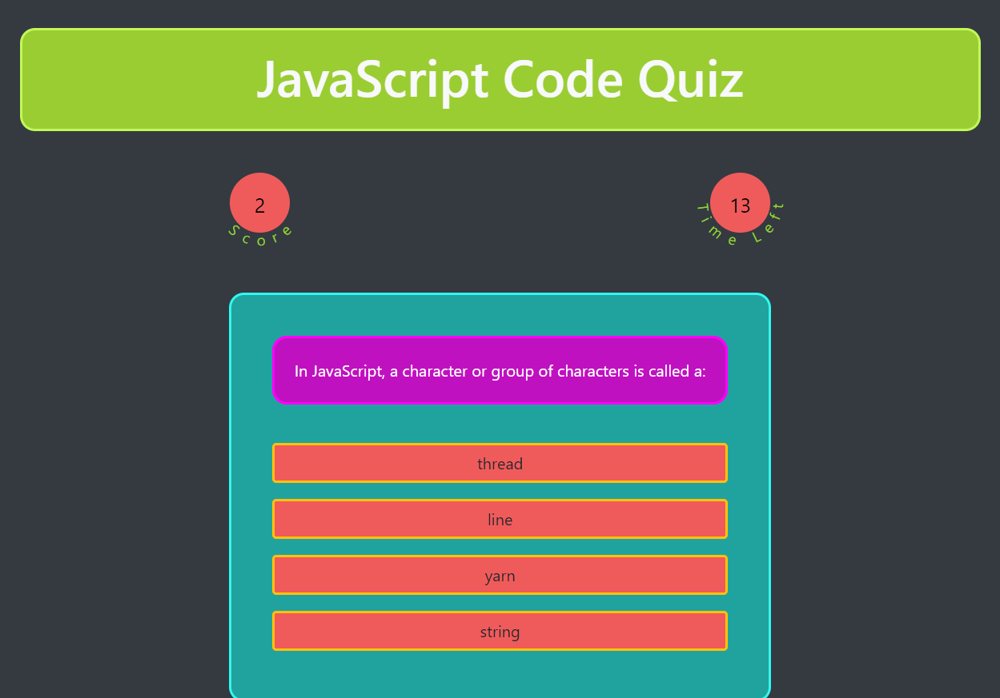

# CODE QUIZ
A timed JavaScript code quiz project

https://rebgrasshopper.github.io/codequiz/

Table of Contents:

- [Section 1: Introduction](#introduction)
- [Section 2: Usage](#usage)
- [Section 3: Credits](#credits)
- [Section 4: License](#license)

## Introduction ##

This project can be accessed from any browser on an internet-connected device. It uses a button/input interface to display and answer questions and accept user initials to store in high scores, and saves high scores to local storage.

This quiz contains ten JavaScript code questions, compiled or inspired from either [JavaScript on Flashcard Machine](https://www.flashcardmachine.com/javascript2.html) or [JavaScript Flashcards by SeanMarkham on Quizlet](https://quizlet.com/5310015/javascript-flash-cards/).

## Usage ##

The source files for this quiz can be accessed through cloning the GitHub repo. The link above will take you to the deployed project.

## Credits ##

Thanks to my coding co-op, and you can catch some of 'em here:

- [Zachary Bryan](https://github.com/zacharybryan)
- [Tim Sanders](https://github.com/tbsanders5)
- [Nick Konzen](https://github.com/NTKonzen)
- [Kira Bismuth Lowrey](https://github.com/KILowrey)
- [Nancy Lambert-Brown](https://github.com/n-lambert)
- [Mando Estrada](https://github.com/Mando619)
- [Talia Vazquez](https://github.com/taliavazquez)
- [Perry Theobald](https://github.com/perrytjr)
- [Jeneth Diestra](https://github.com/jen6one9)
- [Matthew Rogers](https://github.com/Rogers-Development-Services)
- [Jefrrey Choi](https://github.com/jepoy92)

## License ##

GNU General Public License